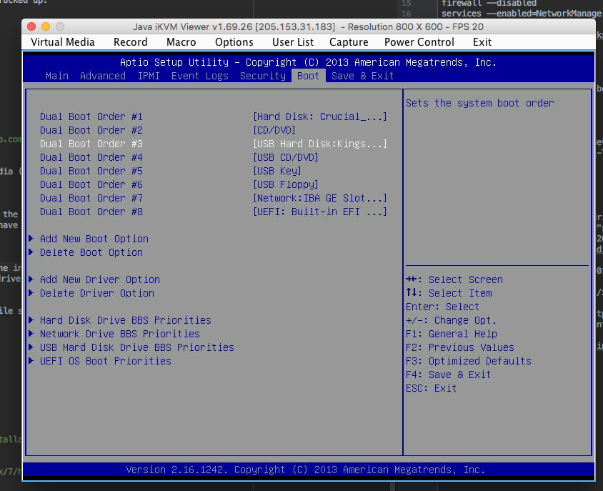

========
Overview
========

.. start-badges

.. list-table::
    :stub-columns: 1

    * - docs
      - |docs|
    * - tests
      - | |travis| |appveyor| |requires|
        | |codecov|
    * - package
      - | |version| |wheel| |supported-versions| |supported-implementations|
        | |commits-since|
.. |docs| image:: https://readthedocs.org/projects/python-collector-install/badge/?style=flat
    :target: https://readthedocs.org/projects/python-collector-install
    :alt: Documentation Status

.. |travis| image:: https://travis-ci.org/natemarks/python-collector-install.svg?branch=master
    :alt: Travis-CI Build Status
    :target: https://travis-ci.org/natemarks/python-collector-install

.. |appveyor| image:: https://ci.appveyor.com/api/projects/status/github/natemarks/python-collector-install?branch=master&svg=true
    :alt: AppVeyor Build Status
    :target: https://ci.appveyor.com/project/natemarks/python-collector-install

.. |requires| image:: https://requires.io/github/natemarks/python-collector-install/requirements.svg?branch=master
    :alt: Requirements Status
    :target: https://requires.io/github/natemarks/python-collector-install/requirements/?branch=master

.. |codecov| image:: https://codecov.io/github/natemarks/python-collector-install/coverage.svg?branch=master
    :alt: Coverage Status
    :target: https://codecov.io/github/natemarks/python-collector-install

.. |version| image:: https://img.shields.io/pypi/v/collector-install.svg
    :alt: PyPI Package latest release
    :target: https://pypi.org/project/collector-install

.. |commits-since| image:: https://img.shields.io/github/commits-since/natemarks/python-collector-install/v0.0.0.svg
    :alt: Commits since latest release
    :target: https://github.com/natemarks/python-collector-install/compare/v0.0.0...master

.. |wheel| image:: https://img.shields.io/pypi/wheel/collector-install.svg
    :alt: PyPI Wheel
    :target: https://pypi.org/project/collector-install

.. |supported-versions| image:: https://img.shields.io/pypi/pyversions/collector-install.svg
    :alt: Supported versions
    :target: https://pypi.org/project/collector-install

.. |supported-implementations| image:: https://img.shields.io/pypi/implementation/collector-install.svg
    :alt: Supported implementations
    :target: https://pypi.org/project/collector-install

.. end-badges

install tools for collectors

* Free software: BSD 2-Clause License

Installation
============

::

    pip install collector-install

Documentation
=============
This project contains the tools for installing collectors. It requries the kickstart files generated by the https://github.com/mcapelli/collector_kickstarts project.  Collector_kickstarts requires data from the https://github.com/mcapelli/python-grains_from_collectors  project.

The general usage of this project is:
- create a custom installation USB
- copy a compressed image of that USB to the target collector
- write the image to the collector's USB drive. NOTE:  the target USB drive has to exactly match the source USB drive
- mount the partition on the USB collector and copy that collector's unique kickstart to minimal.ks
- reboot from the USB and run the installation
- configure and run the salt minion to proceeed with the collector installations

Creating the install USB from scratch
-------------------------------------

We based creation of the bootable install USB on  https://gist.github.com/maikell/58b286a672a82dafe44c0552cd44db04 and modified it to create kickstart-centos7-usb.md. Use the instructions in kickstart-centos7-usb.md and test it before moving on.

One quirk to this process is that after the install, it comes up on the installed disk, but the USB drive shows up as /dev/sda and the hard disk that it's booting from shows up as /dev/sdb. I disabled the USB hard drive from the boot options and the disk drive cam up as sda. That stuck even after I re-enabled the USB drive as a boot optiong

To disable the USB drive on supermicro so to BIOS:
boot -> USB Hard Disk Drive BBS Priorities -> toggle the USB to disabled  and save.

.. |sdffff| image:: images/supermicro-usb-boot-2.jpg

Creating and using the image
----------------------------

First identify the removable device.

::

    [root@PROD01-ZDEL-TEST-001 IMAGE]# cat /sys/block/sda/removable
    0
    [root@PROD01-ZDEL-TEST-001 IMAGE]# cat /sys/block/sdb/removable
    1

In this case, the removable drive is /dev/sdb so we'll create the image and compress it on the fly

::

    dd if=/dev/sdb bs=1M status=progress | gzip > ./usb_installer.dd.gz

to write the image to /dev/sdb.  Be VERY carefule.  this will destroy the target drive

::

    gunzip -c ./usb_installer.dd.gz | dd of=/dev/sdb bs=1M status=progress

Som other related articles:

https://gist.github.com/maikell/58b286a672a82dafe44c0552cd44db04

https://gist.github.com/maikell/58b286a672a82dafe44c0552cd44db04
https://shawnliu.me/post/kickstart-centos-7-installation/

http://www.softpanorama.info/Commercial_linuxes/RHEL/Installation/installation_from_usb_drive.shtml

kickstart shell troubleshooting by looking at logs:
https://access.redhat.com/documentation/en-us/red_hat_enterprise_linux/7/html/installation_guide/sect-consoles-logs-during-installation-x86

Development
===========

To run the all tests run::

    tox

Note, to combine the coverage data from all the tox environments run:

.. list-table::
    :widths: 10 90
    :stub-columns: 1

    - - Windows
      - ::

            set PYTEST_ADDOPTS=--cov-append
            tox

    - - Other
      - ::

            PYTEST_ADDOPTS=--cov-append tox
